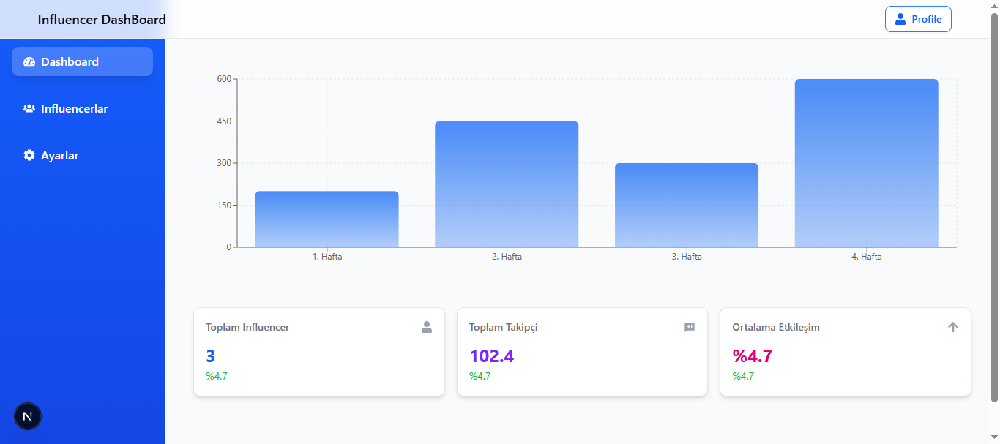

# Influencer DashBoard Uygulama Case

## Projeyi Çalıştırma
- Repo'yu klonlayın: `git clone reponun URL'si `
- Gerekli paketleri yükleyin: `pnpm install`
- Uygulamayı başlatın: `pnpm run dev`
- Tarayıcıda açın: `http://localhost:3000`
- Canlı gösterim: https://influencercasedemo.netlify.app/

## Kullanılan Teknolojiler
- Next.Js 15
- React.js 18
- TypeScript
- Tailwind.CSS
- Recharts
- React-Icons
- Motion (framer-motion)
- shadcn/ui

## Tasarım Tercihleri
- Estetik görünüm için modern ve okunaklı UI tasarlandı.
- Kullanıcı geri bildirim için toast animasyonu kullanıldı
- Menü linkleri efektif çalışması için settings, influencers adlı sayfalar oluşturuldu.